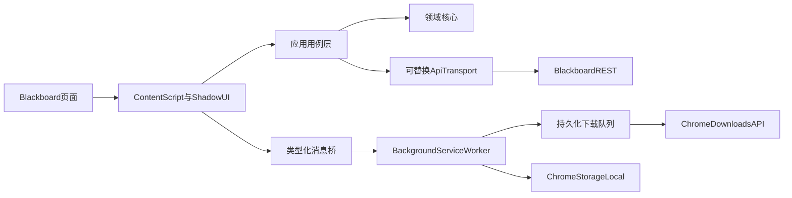
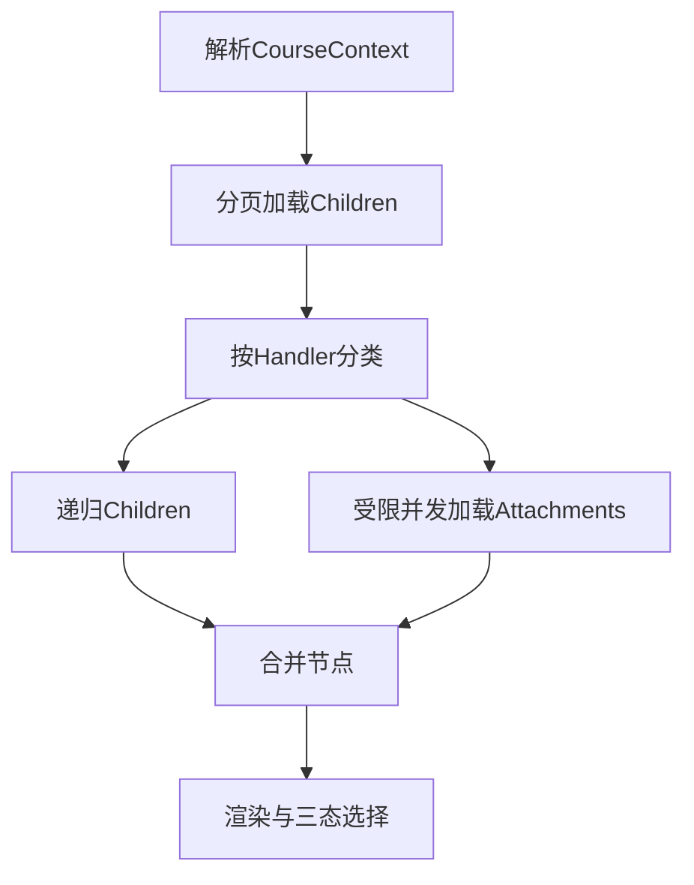

# Better Blackboard — 服务端调研与整体架构规划

> 所有标记为「已验证」的事实均来自真实 Blackboard 页面 Console（页面主世界）的实测。
> 页面主世界、扩展 content script（isolated world）和 background service worker 的网络行为不能等同;
> 涉及扩展权限、Cookie、CORS 与下载重定向的结论，必须在真实 Manifest V3 扩展中再次验证。
> 标记为「未验证」的部分**不得当作已知条件**。

---

## 1. 项目目标

一个 Chrome 扩展(Manifest V3),在 Blackboard Learn 页面注入图形界面,把原本需要逐个点击的操作变成批量操作。参考形态:GitHub 增强类扩展——不替换原站,而是在原站上叠加一层更好用的交互。

**首个目标机构**:香港中文大学(深圳),`https://bb.cuhk.edu.cn`

**核心价值主张**:相比现有的桌面同步工具(如 BlackboardSync),浏览器扩展直接继承用户已登录的会话,**不需要实现任何登录/SSO 逻辑**。这是架构上的决定性优势,也是本项目选择扩展形态的根本原因。

---

## 2. 服务端调研结果(已验证)

调研目标实例:`bb.cuhk.edu.cn`,样本课程 `PHY1001:Mechanics_L01`。

### 2.1 平台基本信息

| 项 | 值 | 说明 |
|---|---|---|
| Base URL | `https://bb.cuhk.edu.cn` | |
| API 前缀 | `/learn/api/public/v1` | Anthology Blackboard Learn REST API |
| 界面版本 | `ultraStatus: "Classic"` | **Original 界面**,非 Ultra |
| 页面路由 | `/webapps/blackboard/content/listContent.jsp?course_id=...&content_id=...` | Original 特征路由 |

### 2.2 页面会话认证模型 ✅ 已在页面主世界验证

**public v1 API 接受已登录 Blackboard 页面的 session cookie。**

```js
fetch('/learn/api/public/v1/courses/_17458_1', { credentials: 'include' })
// → 200 OK
```

这意味着:

- **不需要** Developer Portal 的 Application ID / key / secret
- **不需要** 学校管理员在后台注册 REST integration
- 页面主世界可以复用现有登录态
- content script 与 background 能否同样携带 Cookie，仍需按 §3 在真实扩展中补测

> 官方 REST integration 路径已确认不可行:Blackboard 默认不启用任何 integration,必须由 Learn 管理员在 Administrator Panel → Integrations → REST API integrations 中手动创建。个人开发者拿不到此授权。本项目**不走这条路**。

### 2.3 ID 体系 ⚠️ 易混淆

Blackboard 使用 PK1 格式内部主键,形如 `_{数字}_{数字}`。存在三种彼此独立的 ID,**命名时必须区分**:

```jsonc
// GET /courses/_17458_1
{
  "id":        "_17458_1",              // PK1,URL 中的 course_id 参数用的是它
  "courseId":  "PHY100126103015",       // Batch UID,教务系统编号
  "name":      "PHY1001:Mechanics_L01", // 人类可读名
  "organization": false,
  "ultraStatus":  "Classic"
}
```

**陷阱**:URL 参数名叫 `course_id`,但对应的是 REST 响应里的 `id` 字段,不是 `courseId` 字段。

建议在代码中重命名以杜绝混淆:

```ts
interface Course {
  pk1: string;       // "_17458_1"      ← 一切 API 路径参数用这个
  batchUid: string;  // "PHY100126103015"
  name: string;      // "PHY1001:Mechanics_L01"
  ultraStatus: 'Classic' | 'Ultra' | string;
}
```

若要用 batchUid 查询,需加前缀:`/courses/courseId:PHY100126103015/contents`。

**内容项 ID 与附件 ID 不相同**(已实测):

```
contentId:    _656083_1
attachmentId: _2970202_1
相同: false
```

因此取文件必然是两步请求,无法从内容项 ID 直接拼出下载链接。

### 2.4 内容树结构

```
GET /courses/{pk1}/contents/{contentId}/children?fields=id,title,body,contentHandler,hasChildren
→ { results: [...] }
```

`fields` 参数可用,建议显式指定以减少载荷。**注意 `body` 字段默认不返回,必须显式请求。**

已观察到的 `contentHandler.id` 取值:

| 值 | 含义 | 处理方式 |
|---|---|---|
| `resource/x-bb-folder` | 文件夹 | 递归 `children` |
| `resource/x-bb-file` | 单文件项 | 查 `/attachments` |
| `resource/x-bb-document` | 文档项,**可含多个附件** | 查 `/attachments`,按数组处理 |
| `resource/x-bb-externallink` | 外链 | MVP 跳过 |
| `resource/x-bb-blti-link` | LTI 工具 | MVP 跳过 |

> 样本课程中只出现了前两种。后三种来自 Blackboard 通用模型,实现时必须容错,不能假设只有 file/folder。

样本课程实际结构(已实测):

```
📁 Course Outline
  📄 Course Outline                → PHY1001 Course Outline AY26-27 T1.pdf
📁 Lecture Notes
  📁 Chapter 0 Introduction
    📄 Chapter 0 Introduction      → Chapter 0 Introduction.pdf
  📁 Chapter 1  Units, ...
    📄 Chapter 1  Units, ...       → Chapter 1  Units, Physical Quantities and Vectors.pdf
  ...
📁 Textbook
  📄 [Hugh_D._Young,...]           → [Hugh_D._Young,_Roger_A._Freedman]_Sears_and_Zeman(b-ok.org).pdf
📁 TAs List
  📄 TAs                           → TA Intro_PHY1001 Mechanics.pdf
📁 Additional Summaries
  📁 Week 1
    📄 Week 1                      → Lecture-Week-1.pdf
```

### 2.5 附件端点 ✅ 关键结论

```
GET /courses/{pk1}/contents/{contentId}/attachments
→ { results: [{ id, fileName, mimeType }] }
```

**样本课程中所有叶子节点的 `attachments` 均返回 1 个结果,`body` 中的 `bbcswebdav` 裸链接数量为 0。**

这排除了最坏情况。原计划中的「HTML 正文解析 fallback」模块**在 MVP 中不需要实现**,只需在 adapter 接口中保留扩展点。

**错误码语义**(实测):

| 场景 | 返回 |
|---|---|
| 对 `x-bb-folder` 请求 `/attachments` | `400 Bad Request` |
| 对不存在的 contentId 请求 | `403 Forbidden` |

⚠️ 400 **不代表端点不可用**,只代表该内容项类型不支持附件。调研初期曾因对文件夹批量请求 attachments 而误判端点失效——实现时应先按 `contentHandler.id` 过滤,不要对文件夹发请求。

### 2.6 下载端点 ⚠️ 部分未验证

```
GET /courses/{pk1}/contents/{contentId}/attachments/{attachmentId}/download
```

**已验证**:该端点返回 **302 重定向**,不是 200 直出。

```js
fetch(dl, { credentials: 'include', redirect: 'manual' })
// → status: 0, type: 'opaqueredirect'
```

`opaqueredirect` 下所有 header 不可读,属预期行为。

---

## 3. 架构门禁与未验证项

### 3.1 阶段 0：真实扩展环境门禁

以下项目会直接决定网络与下载实现，必须使用**打包后的 Manifest V3 扩展**验证，而不能只在页面 Console 中验证：

| # | 待确认 | 验证位置 | 通过标准 |
|---|---|---|---|
| G1 | content script 能否请求 REST API 并携带登录 Cookie | isolated world | `/users/me` 和样本课程接口返回 JSON，而非登录页 |
| G2 | background fetch 能否携带登录 Cookie | service worker | 持有精确 host permission 后返回与页面一致的数据 |
| G3 | `chrome.downloads.download()` 能否完成 302 下载 | service worker | 文件下载完成且内容有效，不只验证重定向 URL |
| G4 | 302 跳转到跨域 CDN 时是否仍可下载 | service worker | Chrome 自动完成重定向，不要求扩展读取最终 URL |
| G5 | 中文、空格和长文件名能否写入子目录 | downloads API | 文件落在预期相对路径，名称没有乱码 |
| G6 | 登录失效时各执行环境返回什么 | content/background | 能稳定归类为“未登录”，不会误报网络故障 |

若 G1 与 G2 均可用，优先采用请求链路更短的 content transport，background transport 作为降级。若只有 G2 可用，所有 REST 请求通过类型化消息委托给 background。业务层不感知选择结果。

### 3.2 可并行补测项

| # | 待确认 | 影响 | 补测方法 |
|---|---|---|---|
| 1 | `Content-Disposition` / `Content-Length` 是否可读 | 影响大小预览与精确进度，不影响下载功能 | 实际下载时观察 `chrome.downloads.DownloadItem` 的 `totalBytes` |
| 2 | children 和课程列表的默认页大小与 `paging.nextPage` 格式 | 决定分页器实现和测试夹具 | 构造或寻找超过单页上限的目录 |
| 3 | `/users/me/courses` 是否可用 | 决定跨课程功能 | `GET /users/me/courses?expand=course&limit=100` |
| 4 | 课程列表能否区分当前学期 / 已归档 | 影响课程选择 UI | 检查 `term`、`availability` 与归档课程样本 |
| 5 | 其他课程是否出现多附件、未知 handler 或“既有子项又有附件” | 决定遍历兼容范围 | 换 2–3 门不同院系课程重跑调研脚本 |
| 6 | 正文中的 `bbcswebdav` 裸链接 | 决定 HTML fallback 优先级 | 只在后续阶段显式请求 `body` 并统计 |
| 7 | 增量同步可依赖哪些字段 | 决定变更指纹 | 比较 content 与 attachment 的 `modified`、ID 和文件名变化 |

阶段 0 只负责消除架构不确定性，不在调研脚本中实现完整产品逻辑。

---

## 4. 技术栈规划

### 4.1 核心选型

| 层 | 选型 | 约束与理由 |
|---|---|---|
| 包管理 | **pnpm** | 锁定依赖图，CI 使用 frozen lockfile |
| 扩展框架 | **WXT** | 基于 Vite，统一生成 Manifest V3 entrypoint 与开发构建 |
| 语言 | **TypeScript strict** | 禁止隐式 `any`，跨运行时消息与领域模型均有静态约束 |
| UI | **React** | 只运行于注入的侧栏和 popup |
| 样式 | **Tailwind CSS + Shadow DOM** | 隔离 Blackboard 全局 CSS；样式产物注入 shadow root |
| UI 状态 | **React Context + useReducer** | MVP 状态规模有限，不引入 Zustand/Redux |
| 持久化 | **`chrome.storage.local`** | 保存下载任务与启用配置；MVP 不需要 IndexedDB |
| 下载 | **`chrome.downloads` API** | 交给浏览器处理 Cookie、重定向、进度和落盘 |
| 单元测试 | **Vitest** | 测试领域逻辑、分页、重试、路径和任务状态机 |
| 组件测试 | **React Testing Library** | 测试树选择、加载态、错误态和下载面板 |
| 端到端测试 | **Playwright + Chromium** | 使用持久化浏览器上下文加载构建后的扩展 |
| 代码质量 | **ESLint + Prettier** | 类型检查、React 规则和统一格式 |
| CI | **GitHub Actions** | 执行 lint、typecheck、unit test 和 build |

### 4.2 版本与依赖策略

- 初始化时选择稳定版本并提交 `pnpm-lock.yaml`，本文档不记录未经安装验证的具体版本号。
- 生产依赖保持最小：WXT、React、Tailwind 之外，不为简单队列、重试或状态机引入大型库。
- Chrome Manifest V3 是首要运行目标；Firefox/Edge 兼容不作为 MVP 验收条件。
- 仅使用浏览器已提供能力，不引入远程脚本、远程配置或扩展内更新代码。

### 4.3 明确不采用

- 不用 blob + offscreen document 保存文件。
- 不在 MVP 引入 Redux、IndexedDB、服务端数据库或云同步。
- 不提前建设 adapter 插件市场、动态加载器或配置 DSL。
- 不把 DOM scraping 作为 REST 可用机构的主路径。

---

## 5. 总体架构

### 5.1 架构原则

1. **领域核心与扩展 API 隔离**：遍历、命名、选择和任务状态机必须可在 Node 测试。
2. **运行时边界明确**：content 负责页面上下文与 UI，background 负责持久队列与下载。
3. **依赖倒置**：业务用例依赖 `ApiTransport`、`TaskStore`、`DownloadGateway` 接口，不直接依赖 `chrome.*`。
4. **先验证再选择传输路径**：content/background 的 Cookie 行为以阶段 0 实测为准。
5. **失败可恢复**：任何时刻终止 service worker，都不能导致已启动下载失去追踪。
6. **最小权限**：只申请已支持学校的 HTTPS origin，页面数据不离开本机。

### 5.2 运行时拓扑



### 5.3 运行时职责

| 运行时 | 负责 | 不负责 |
|---|---|---|
| popup | 当前站点识别、权限申请、启用/停用入口 | 内容遍历、下载调度 |
| content script | 解析课程上下文、挂载 Shadow DOM、运行 UI 用例、订阅任务快照 | 直接调用 downloads API、保存权威队列状态 |
| background service worker | 权限核验、REST 降级代理、下载队列、持久化、恢复、下载事件 | React UI、依赖页面 DOM |
| core/application | 遍历、附件预取、下载计划生成、错误归类 | 访问具体浏览器 API |
| core/domain | 类型、纯函数、状态迁移和业务不变量 | 网络、存储、UI |

### 5.4 目录结构

```text
.
├── src/
│   ├── entrypoints/
│   │   ├── background.ts
│   │   ├── content/
│   │   │   ├── index.tsx
│   │   │   └── style.css
│   │   └── popup/
│   │       ├── index.html
│   │       └── App.tsx
│   ├── core/
│   │   ├── domain/
│   │   │   ├── course.ts
│   │   │   ├── content.ts
│   │   │   ├── download-task.ts
│   │   │   └── naming.ts
│   │   └── application/
│   │       ├── load-content-tree.ts
│   │       ├── create-download-plan.ts
│   │       └── reconcile-downloads.ts
│   ├── infrastructure/
│   │   ├── blackboard/
│   │   │   ├── api-client.ts
│   │   │   ├── paginator.ts
│   │   │   ├── retry.ts
│   │   │   └── transports/
│   │   │       ├── content-fetch.ts
│   │   │       └── background-rpc.ts
│   │   └── extension/
│   │       ├── downloads/
│   │       │   ├── chrome-download-gateway.ts
│   │       │   └── persistent-queue.ts
│   │       ├── messaging/
│   │       │   ├── contracts.ts
│   │       │   └── bridge.ts
│   │       ├── permissions.ts
│   │       └── task-store.ts
│   ├── adapters/
│   │   ├── types.ts
│   │   └── cuhksz.ts
│   └── ui/
│       ├── Sidebar.tsx
│       ├── ContentTree.tsx
│       └── DownloadPanel.tsx
├── tests/
│   ├── fixtures/
│   ├── unit/
│   ├── components/
│   └── e2e/
├── wxt.config.ts
├── tsconfig.json
└── package.json
```

`core/domain` 不得导入 WXT、React、Chrome 类型或具体网络 client。`core/application` 可以依赖自身定义的端口接口；具体实现放在 `infrastructure`。

### 5.5 学校 Adapter

```ts
export interface SchoolAdapter {
  id: string;
  displayName: string;
  matches(url: URL): boolean;
  apiBasePath: string;
  parseCourseContext(url: URL): CourseContext | null;
  courseFolderName(course: Course): string;
  extractFallbackResources?(node: ContentNode): DownloadResource[];
}
```

Adapter 只表达确实存在的校间差异。MVP 只有静态注册的 `cuhksz` adapter；不支持运行时下载第三方 adapter。

---

## 6. 领域模型与边界契约

### 6.1 核心模型

```ts
interface Course {
  pk1: string;
  batchUid: string;
  name: string;
  ultraStatus: 'Classic' | 'Ultra' | string;
}

interface CourseContext {
  origin: string;
  coursePk1: string;
  contentPk1: string;
  scope: 'current-content';
}

interface ContentNode {
  pk1: string;
  title: string;
  handlerId: string;
  hasChildren: boolean;
  children: ContentNode[];
  attachments: Attachment[];
}

interface Attachment {
  pk1: string;
  contentPk1: string;
  fileName: string;
  mimeType?: string;
}
```

MVP 的根语义明确为 URL 中 `content_id` 对应的**当前内容区**。整门课程所有顶层内容需要另行验证根列表端点，放到阶段 2。

`hasChildren` 与“是否拥有附件”是两个独立维度：

- `x-bb-folder` 只递归 children，不请求 attachments。
- `x-bb-file`、`x-bb-document` 请求 attachments。
- 其他 handler 若 `hasChildren=true` 仍递归；是否查询附件由可测试的 handler capability 表决定。
- 未知 handler 必须显示为“不支持的内容”，不能静默消失。

### 6.2 网络端口

```ts
interface ApiTransport {
  request<T>(request: ApiRequest, signal?: AbortSignal): Promise<T>;
}

interface ApiPage<T> {
  results: T[];
  paging?: {
    nextPage?: string;
  };
}
```

`ApiRequest` 只允许相对于已授权 Blackboard origin 的 API 路径，background 不接受任意完整 URL 代理请求。分页器负责消费全部页面，业务用例不能直接读取一次 `results` 后结束。

### 6.3 下载任务

```ts
type DownloadStatus =
  | 'queued'
  | 'starting'
  | 'in_progress'
  | 'complete'
  | 'interrupted'
  | 'canceled';

interface DownloadTask {
  taskId: string;
  origin: string;
  coursePk1: string;
  contentPk1: string;
  attachmentPk1: string;
  targetPath: string;
  status: DownloadStatus;
  chromeDownloadId?: number;
  bytesReceived?: number;
  totalBytes?: number;
  error?: DownloadError;
  createdAt: number;
  updatedAt: number;
}
```

合法主流程为：

```text
queued -> starting -> in_progress -> complete
                    -> interrupted
queued/starting/in_progress -> canceled
```

重试中断任务时创建新的下载尝试并保留关联，不能把旧的 Chrome download ID 覆盖掉。用户取消不自动重试。

### 6.4 消息契约

content 与 background 之间只传可结构化克隆的数据，消息采用带版本和判别字段的联合类型：

```ts
type ExtensionMessage =
  | { v: 1; type: 'api.request'; requestId: string; payload: ApiRequest }
  | { v: 1; type: 'downloads.enqueue'; requestId: string; tasks: DownloadTaskInput[] }
  | { v: 1; type: 'downloads.cancel'; requestId: string; taskId: string }
  | { v: 1; type: 'downloads.snapshot'; tasks: DownloadTask[] };
```

每个 request 必须收到 success/error envelope。background 校验 `sender.tab.url`、已授权 origin、adapter 匹配和消息字段，不信任 content 传入的 origin。

---

## 7. 核心运行流程

### 7.1 启用与注入

1. 用户在 Blackboard 页面点击扩展图标。
2. popup 读取当前 tab URL，只接受 `https:` 且命中已注册 adapter。
3. 申请该 adapter 声明的精确 origin 权限。
4. 使用轻量 `GET /learn/api/public/v1/users/me?fields=id` 探测；不能依赖服务器支持 `HEAD`。
5. 验证状态码、`Content-Type` 和最终 URL，防止把跳转后的 SSO HTML 当作成功 JSON。
6. 为当前 tab 注入 content script，并注册后续匹配页面的 content script。
7. content script 使用固定 DOM 标记保证重复注入幂等。

Chrome 的权限记录是授权事实来源。`storage.local` 只保存“用户是否启用该 adapter”等产品配置；启动时必须与 `chrome.permissions.contains()` 对账。

### 7.2 API 传输策略

`BbApiClient` 只依赖 `ApiTransport`：

- `ContentFetchTransport`：在 content isolated world 发起同站请求。
- `BackgroundRpcTransport`：content 发送受限 API request，由 background fetch。
- 阶段 0 根据真实 Cookie/CORS 行为确定默认实现。
- 默认 transport 遇到明确的环境限制时可切换一次；401/403、429 和业务 400 不能触发无限换路重试。

所有 ID 作为 URL path segment 时必须使用 `encodeURIComponent`。不允许调用方直接拼接未校验 URL。

### 7.3 内容树加载



遍历约束：

- 所有列表端点通过统一 paginator 消费 `paging.nextPage`。
- API 并发默认 4；配置集中管理，不散落魔法数字。
- 使用 `AbortSignal`：关闭侧栏、切换课程或页面卸载时取消未完成请求。
- 使用 `visited contentPk1` 防止异常数据形成循环。
- 设置可配置的最大节点数；触发时展示“内容过多”而不是卡死页面。
- 遍历时预取附件，使用户点击下载后立即入队。
- MVP 不请求 `body`，避免传输和处理不需要的 HTML；HTML fallback 阶段再显式开启。

### 7.4 重试与错误归类

只对幂等 GET 的网络错误、408、429 和 5xx 重试，默认最多 3 次：

- 429 优先遵守 `Retry-After`。
- 其他可重试错误使用指数退避并加 jitter。
- 400、401、403 和用户主动取消不重试。
- 401 或跳到登录页：`auth_required`。
- 已授权但目标不可达：`network_unreachable`，提示检查校园网/VPN。
- 403：`access_denied`，不能根据已观察到的“无效 ID 返回 403”推断为未登录。
- 响应不是预期 JSON：`api_incompatible`。

UI 只依赖稳定错误码，原始错误信息仅用于本地诊断。

### 7.5 下载计划与队列

1. application 层把勾选附件转换成不可变 `DownloadTaskInput[]`。
2. background 校验 origin、ID 和目标路径。
3. 任务先写入 `storage.local`，成功后才能进入内存队列。
4. 下载并发默认 2，与 API 并发分开限制。
5. 每个任务调用一次 `chrome.downloads.download()`，使用 API 下载端点而非预解析签名 URL。
6. 获取 `chromeDownloadId` 后立即持久化映射。
7. `chrome.downloads.onChanged` 是增量事件；queue manager 合并增量后产生完整任务快照。
8. content 重连时主动请求快照，不依赖错过的历史事件。

```ts
chrome.downloads.download({
  url: downloadUrl,
  filename: targetPath,
  conflictAction: 'uniquify',
  saveAs: false,
});
```

若用户在 Chrome 设置中开启“下载前询问每个文件的保存位置”，浏览器仍可能逐个弹窗；UI 应提示这是浏览器设置，不尝试绕过。

### 7.6 service worker 恢复

service worker 每次启动执行幂等 reconcile：

1. 从 `storage.local` 读取非终态任务。
2. 对有 `chromeDownloadId` 的任务调用 `chrome.downloads.search()`。
3. 把 Chrome 状态映射回任务状态并持久化。
4. `queued` 任务重新进入队列；`starting` 且无 download ID 的任务标为 interrupted，避免重复下载。
5. 清理已不存在的 Chrome download ID，并保留可见错误。

下载完成或失败等关键状态立即写盘；高频 bytes 进度做节流写盘。终态记录设置数量或时间上限，避免 `storage.local` 无限增长。

### 7.7 路径生成

目标格式：

```text
BB/{courseFolder}/{relativeContentPath}/{fileName}
```

每个 segment 使用同一纯函数规范化：

- Unicode 统一为 NFC。
- 替换控制字符和 `\\ / : * ? " < > |`。
- 合并连续空白，移除尾部空格和点。
- 拒绝空 segment、`.` 与 `..`。
- Windows 保留名 `CON`、`PRN`、`AUX`、`NUL`、`COM1..9`、`LPT1..9` 添加安全前缀。
- segment 过长时保留扩展名并追加稳定短 hash。
- 总路径过长时确定性缩短中间 segment，不改变课程目录和最终文件名的可识别部分。

文件名始终优先使用 API 的 `fileName`。冲突交给 `conflictAction: 'uniquify'`。

单文件目录拍平只在以下条件全部满足时执行：

1. 文件夹只有一个文件且没有其他子节点。
2. 规范化后的文件夹名与去扩展名后的文件名完全相同，比较时忽略大小写与连续空白。
3. 拍平后不会造成计划内路径冲突。

MVP 不使用模糊相似度，保证结果可预测、可测试。

---

## 8. UI 与状态规划

### 8.1 UI 状态

content UI 使用单一 reducer 管理：

- `context`：当前课程与内容区。
- `tree`：加载状态、节点和选择状态。
- `downloads`：background 返回的权威任务快照。
- `connection`：ready、auth_required、offline、unsupported。

React state 只负责当前页面会话。下载任务的权威状态在 background + `storage.local`，UI 刷新后必须可恢复。

### 8.2 侧栏交互

- Shadow DOM host 固定挂载在 `document.documentElement` 下，使用高但有限的 z-index。
- 打开后先显示骨架和当前课程信息，再渐进展示内容树。
- checkbox 支持 checked、unchecked、indeterminate，父子选择由纯函数计算。
- 下载前显示文件数和目标根目录；未知大小不伪造百分比。
- `totalBytes <= 0` 时使用不确定进度，已知时显示字节进度。
- 下载失败提供“重试该项”，取消提供明确确认，不把用户取消显示为错误。
- 页面 URL 变化或重复注入时重新解析 context；context 改变会取消上一轮遍历。

React portal、tooltip 或 modal 必须挂到 shadow root 内，避免样式泄漏回页面。

---

## 9. 权限、安全与隐私

### 9.1 MVP 权限

概念上的最小 Manifest：

```jsonc
{
  "manifest_version": 3,
  "permissions": ["activeTab", "downloads", "storage", "scripting"],
  "optional_host_permissions": ["https://bb.cuhk.edu.cn/*"],
  "action": {
    "default_title": "在此站点启用 Better Blackboard"
  }
}
```

MVP 不申请 `*://*/*`。新增学校时随静态 adapter 增加对应 HTTPS optional host pattern。只有未来明确支持“任意 Blackboard 域名探测”时，才评估 `https://*/*` 及其 Chrome Web Store 审核影响。

### 9.2 信任边界

- 不使用页面 `window.postMessage` 传递特权命令。
- background 对每条消息检查 sender tab、origin、权限与 adapter，不把 content script 视为可信输入。
- API 返回的标题、文件名和错误文本均视为不可信字符串。
- 默认以 React 文本节点渲染，不使用 `dangerouslySetInnerHTML`。
- 若未来渲染 `body`，必须使用独立 HTML sanitizer，并禁止脚本、事件属性和危险 URL scheme。
- 不保存 Cookie、SSO Token、Authorization header 或课程正文。
- 不上传课程列表、文件名、下载历史或诊断日志。

### 9.3 Chrome Web Store 说明

README 与隐私声明需要解释每项权限：

- `activeTab` / `scripting`：用户主动启用时注入侧栏。
- optional host permission：访问用户已登录的 Blackboard API。
- `downloads`：批量保存用户勾选的附件。
- `storage`：恢复启用配置和下载任务。

若未来加入遥测，必须单独设计明确 opt-in；不属于当前架构。

---

## 10. 测试与质量门禁

### 10.1 单元测试

必须覆盖：

- paginator：零页、单页、多页、空 `nextPage`、重复 nextPage。
- retry：429 + `Retry-After`、5xx、不可重试 4xx、AbortSignal。
- traversal：文件夹、文件、document 多附件、未知 handler、既有 children 又有 attachment、循环引用。
- naming：中文、emoji、非法字符、保留名、空名、超长路径、重复名和确定性 hash。
- download state machine：全部合法/非法迁移、取消、重试关联、恢复对账。
- 三态选择：父子选中、部分选中和动态加载节点。

网络测试使用固定 JSON fixture，不依赖学校线上环境。

### 10.2 组件测试

- 加载、空目录、错误、重新登录提示。
- 大树展开和三态 checkbox。
- 下载计划确认、未知大小、失败重试和取消。
- Shadow DOM 内组件渲染，不污染宿主页样式。

### 10.3 扩展端到端测试

Playwright 使用 Chromium persistent context 加载构建产物，配合本地 fixture server 验证：

- popup 权限与注入流程。
- content 到 background 的消息往返。
- 任务写盘、队列并发和 service worker 重启恢复。
- 页面刷新后下载状态恢复。

真实 CUHK(SZ) 环境只用于阶段 0 和发布前手工 smoke test，不把账号或 Cookie 放进 CI。

### 10.4 CI 门禁

每次提交至少执行：

```text
lint -> typecheck -> unit/component tests -> production build
```

端到端测试在环境稳定后加入必需检查。构建产物必须可由 Chrome 正常加载，且 Manifest 中不得出现未说明权限。

### 10.5 本地诊断

- 开发构建允许结构化 console 日志，统一前缀和错误码。
- 生产构建默认只保留必要 warning/error。
- 日志不得包含 Cookie、完整响应正文或签名下载 URL。
- MVP 不接入远程日志平台。

---

## 11. MVP 范围与验收

### 11.1 做

> 打开课程的某个内容区 → 启用扩展 → 侧栏分页加载内容树 → 勾选附件 → 下载到 `BB/{课程名}/{原目录结构}/` → 刷新页面或 service worker 重启后仍能看到任务状态。

MVP 包含：

- CUHK(SZ) adapter。
- 当前 URL `content_id` 范围的内容树。
- 多附件兼容、三态选择和批量下载。
- API 与下载并发控制。
- 持久化任务、进度、取消、失败重试与恢复。
- 未登录、无权限、网络/VPN、API 不兼容的可区分提示。

### 11.2 明确不做

- 整门课程所有入口自动发现。
- 多课程并行与当前学期课程列表。
- 增量同步、DDL 聚合、全局搜索。
- 设置页、云同步、遥测。
- HTML body fallback、外链与视频下载。
- Blackboard Collaborate、Panopto 等独立系统。

### 11.3 MVP 验收清单

- 目录结果超过一页时无遗漏、无重复。
- `x-bb-document` 的多个附件均可独立选择。
- 未知 handler 可见且不阻断其他节点。
- 中文、emoji、重复名、保留名和长路径可安全下载。
- 401/登录跳转提示重新登录；429 按策略退避；VPN 断开提示网络不可达。
- 用户取消不会自动重试，单项失败不会终止整个队列。
- 下载过程中刷新页面，状态可从 background 恢复。
- service worker 被终止并重启后，不重复创建已经开始的下载。
- 浏览器重启后，可对账仍在 Chrome 下载记录中的非终态任务。
- 所有请求只发往已授权 adapter origin，生产日志不包含敏感信息。

---

## 12. 分阶段路线图

| 阶段 | 内容 | 退出条件 |
|---|---|---|
| **0 · 架构验证** | 完成 §3 的 G1–G6 最小扩展 spike | 确定 REST transport，实际文件下载成功 |
| **1 · 工程骨架** | WXT、React、Shadow DOM、消息契约、CI | 空侧栏可注入，content/background 往返通过 |
| **2 · MVP 纵向链路** | 当前内容树、分页、选择、下载队列、恢复 | §11.3 全部通过 |
| **3 · 课程聚合** | `/users/me/courses`、当前学期过滤、整课入口 | 多课程样本验证 term/availability |
| **4 · 增量同步** | 可靠变更指纹、下载历史与差异预览 | 不仅依赖未经验证的 `modified` 字段 |
| **5 · DDL 聚合** | gradebook/assignment 到期日与时区处理 | 验证非 gradebook 作业不会静默遗漏 |
| **6 · 多校扩展** | 新 adapter、HTML fallback、更多 handler | 每所学校有独立 fixture 与权限说明 |

产品差异化集中在增量同步与 DDL 聚合，但不得在 MVP 下载链路稳定前并行扩张范围。

---

## 13. 架构风险与决策记录

| 风险 | 影响 | 当前控制 |
|---|---|---|
| Console 结论无法迁移到扩展环境 | REST 主链路不可用 | 阶段 0 分环境验证 + 可替换 transport |
| 下载重定向依赖 Cookie 或签名 URL | 文件无法保存 | 使用真实 `chrome.downloads` 端到端验证 |
| Blackboard 实例字段/handler 差异 | 漏文件或遍历失败 | 分页器、capability 表、未知类型可见、fixture |
| MV3 service worker 随时终止 | 队列状态丢失或重复下载 | 先写盘、Chrome download ID 对账、幂等恢复 |
| 可选权限与动态注入行为差异 | 用户授权后仍未注入 | 阶段 0 验证 execute/register 流程并做启动对账 |
| 文件路径跨平台差异 | 下载失败或目录不可用 | 纯函数规范化、保守长度限制、跨平台样例测试 |
| API 限流或校园网不稳定 | 加载慢、服务器压力 | 独立并发限制、Retry-After、退避与取消 |

架构决策发生变化时，在本节记录“背景、选择、替代方案、后果”，避免实现与文档长期漂移。

---

## 14. 合规边界

- 只访问用户自己账号已有权限的资源，不做任何越权尝试。
- 并发限制，避免对学校服务器造成压力。
- README 中明确说明：部分机构的服务条款限制对 LMS 的自动化访问，用户需自行确认所在机构政策。
- 不提供绕过权限控制、批量分享受版权保护材料或隐藏访问行为的功能。
- 所有处理默认在本机完成，不建设中转下载服务。

---

## 附录：可复用的页面主世界调研脚本

在 Blackboard 课程页 Console 中运行，用于验证新课程的分页、handler、附件与正文链接。它只能证明页面主世界行为，不能替代阶段 0 的扩展测试。

```js
const API = `${location.origin}/learn/api/public/v1`;
const params = new URLSearchParams(location.search);
const C = params.get('course_id');
const ROOT = params.get('content_id');
const F = 'id,title,body,contentHandler,hasChildren';
const visited = new Set();

function apiUrl(path) {
  if (/^https?:\/\//.test(path)) return path;
  if (path.startsWith('/learn/')) return location.origin + path;
  return API + (path.startsWith('/') ? path : `/${path}`);
}

async function get(path) {
  const response = await fetch(apiUrl(path), { credentials: 'include' });
  const contentType = response.headers.get('content-type') || '';
  if (!response.ok || !contentType.includes('json')) {
    return { _err: response.status, _url: response.url, _contentType: contentType };
  }
  return response.json();
}

async function getAll(path) {
  const results = [];
  const seenPages = new Set();
  let next = path;

  while (next && !seenPages.has(next)) {
    seenPages.add(next);
    const page = await get(next);
    if (page._err) return { ...page, results };
    results.push(...(page.results || []));
    next = page.paging?.nextPage;
  }

  return { results };
}

async function walk(contentPk1, depth = 0) {
  if (!contentPk1 || visited.has(contentPk1)) return;
  visited.add(contentPk1);

  const children = await getAll(
    `/courses/${encodeURIComponent(C)}/contents/${encodeURIComponent(contentPk1)}/children?fields=${F}`,
  );

  for (const node of children.results) {
    const handler = node.contentHandler?.id || 'unknown';
    const isFolder = handler === 'resource/x-bb-folder';
    const pad = '  '.repeat(depth);
    let attachments = { results: [] };

    if (!isFolder) {
      attachments = await getAll(
        `/courses/${encodeURIComponent(C)}/contents/${encodeURIComponent(node.id)}/attachments`,
      );
    }

    const links = node.body?.match(/bbcswebdav[^"'\s]*/g) || [];
    console.log(
      `${pad}${node.hasChildren || isFolder ? 'DIR' : 'ITEM'} ${node.title} | ${handler} | att:${attachments.results.length} | body:${links.length}`,
      attachments._err ? `HTTP ${attachments._err}` : attachments.results,
    );

    if (node.hasChildren || isFolder) {
      await walk(node.id, depth + 1);
    }
  }
}

if (!C || !ROOT) {
  throw new Error('当前 URL 缺少 course_id 或 content_id');
}

walk(ROOT);
```